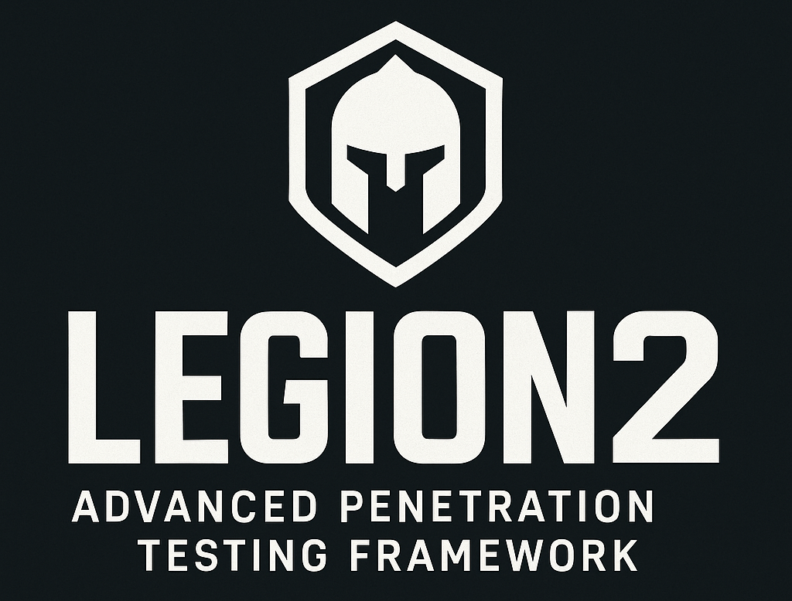

<div align="center">
  

# LEGION2 - Advanced Penetration Testing Framework


## ⚠️ ALPHA VERSION WARNING ⚠️

### Version: 0.0.1-alpha

**LEGION2 is currently in early alpha development and is not yet functional for production use.** The GUI experiences freezing issues, data flow is broken, and multiple components require significant refactoring. This repository represents our active effort to restore and modernize the LEGION penetration testing framework.

## About LEGION2

LEGION2 is a comprehensive modernization of the LEGION penetration testing framework, originally forked from SECFORCE's Sparta. Our mission is to create a stable, high-performance, open-source network penetration testing platform that aids security professionals in discovery, reconnaissance, and exploitation of information systems.

This project addresses the critical issues that led to LEGION being archived in 2024, leaving Kali Linux users with a non-functional tool. LEGION2 represents a complete architectural overhaul designed to eliminate GUI freezes, optimize data flow, and introduce modern development practices for enhanced reliability and performance.

## Current Development Status

**Known Issues in Alpha Version:**

- GUI freezing during scan operations due to qasync coordination problems
- Data flow interruptions between scanning components and interface
- Process management instability with concurrent operations
- Memory leaks during extended scanning sessions
- Database transaction conflicts causing data corruption

**Active Development Goals:**

- Complete architectural refactoring to eliminate GUI thread blocking
- Implementation of proper async patterns for external tool integration
- Migration from PyQt6 to modern framework alternatives (Tauri or FastAPI+React)
- Enhanced error handling and recovery mechanisms
- Comprehensive logging and monitoring capabilities

## Features (Planned/In Development)

LEGION2 will restore and extend the original LEGION feature set with significant improvements:

**Core Scanning Capabilities:**

- Automatic reconnaissance and scanning with NMAP, Whataweb, Nikto, Vulners, Hydra, SMBenum, Dirbuster, SSLyzer, and WebSlayer
- Nearly 100 auto-scheduled security scripts with intelligent scheduling
- Multiple custom scan configurations optimized for different environment types
- Advanced stage scanning with IPS evasion capabilities

**Enhanced User Experience:**

- Responsive graphical interface with rich context menus and intuitive panels
- Real-time progress tracking with completion estimates
- One-click scanning of IP ranges, hostnames, and CIDR subnets
- Granular NMAP scanning options with advanced configuration
- Automatic detection of CPEs (Common Platform Enumeration) and CVEs (Common Vulnerabilities and Exposures)

**Modern Architecture Benefits:**

- Non-blocking async operations preventing GUI freezes
- Structured error handling with automatic recovery
- Real-time auto-saving to prevent data loss
- WebSocket-based real-time updates for collaborative workflows
- Comprehensive audit logging with sensitive data filtering

## Installation

**Note: Installation instructions are provided for development purposes only. The current alpha version is not recommended for production use.**

### Prerequisites

- Python 3.9 or higher
- Modern Linux distribution (Ubuntu 20.04+, Kali 2022+, ParrotOS)
- Docker (recommended for development environment isolation)

### Development Installation

```bash
git clone https://github.com/NubleX/legion2.git
cd legion2
chmod +x install_dev.sh
./install_dev.sh
```

### Docker Development Environment

For development work, we recommend using the Docker environment to avoid dependency conflicts:

```bash
git clone https://github.com/NubleX/legion2.git
cd legion2/docker
chmod +x runIt.sh
./runIt.sh
```

## Architecture Modernization

LEGION2 represents a fundamental architectural transformation from the original LEGION codebase. Our development approach focuses on several key modernization areas:

**Async-First Design:** Complete migration from blocking operations to modern async patterns prevents GUI freezes and enables concurrent scanning operations.

**Modular Framework Architecture:** Clean separation between scanning engines, data processing, and user interface components allows for independent development and testing.

**Modern Technology Stack:** Evaluation of Tauri-based architecture for optimal performance and security, with FastAPI+React as an alternative for web-first deployment scenarios.

**Enhanced Error Handling:** Comprehensive error recovery strategies with circuit breaker patterns and exponential backoff for robust operation in challenging network environments.

## Contributing

LEGION2 is an open-source project that welcomes contributions from the cybersecurity community. Given the current alpha state, we particularly need assistance with:

- GUI framework migration and interface design
- Async operation implementation and optimization
- Security tool integration and testing
- Documentation and user experience improvements
- Performance optimization and memory management

Please review our contribution guidelines and coding standards before submitting pull requests. All contributions must maintain the security focus and professional standards expected of penetration testing tools.

## License

LEGION2 is licensed under the GNU General Public License v3.0. This ensures the tool remains free and open-source for the cybersecurity community while requiring derivative works to maintain the same open-source commitment.

## Attribution and Credits

**LEGION2 Development (2025):**

- Igor Dunaev / NubleX - Lead Developer and Project Maintainer
- Architectural modernization and alpha development coordination

**Original LEGION Development:**

- GoVanguard - Python 3.6+ refactoring, feature additions, and ongoing development leadership
- Dmitriy Dubson - Significant continued contributions to the original project

**Historical Foundation:**

- SECFORCE - Original Sparta Python 2.7 codebase and foundational application design
- batmancrew - Additional PortActions, PortTerminalActions, and SchedulerSettings
- yunshu, ketchup, and SECFORCE - XML output parsing engine development
- Bernardo Damele A.G. - ms08-067_check script used by smbenum.sh

**Technology Acknowledgments:**
LEGION2 builds upon the work of numerous open-source projects including NMAP, Hydra, Python, PyQt, SQLAlchemy, and many other essential security tools. We extend our gratitude to all developers and maintainers of these foundational technologies.

**Special Recognition:**
We acknowledge the original vision of SECFORCE in creating Sparta and GoVanguard's substantial efforts in modernizing the codebase to create LEGION. LEGION2 continues this tradition of community-driven security tool development while addressing the architectural challenges that led to the original project's archive status.

## Roadmap and Future Development

**Phase 1 (Current):** Stabilization of core functionality and resolution of critical GUI issues
**Phase 2:** Migration to modern framework architecture with enhanced performance
**Phase 3:** Implementation of advanced scanning capabilities and collaborative features
**Phase 4:** Integration of machine learning for intelligent vulnerability assessment

## Support and Community

For development discussions, bug reports, and feature requests, please utilize our GitHub Issues system. As this is an alpha project under active development, we recommend joining our development community for real-time collaboration and support.

**Important Note:** LEGION2 is designed for authorized penetration testing and security assessment activities only. Users are responsible for ensuring compliance with all applicable laws and regulations in their jurisdiction.

---

*LEGION2 - Modernizing penetration testing for the next generation of cybersecurity professionals.*