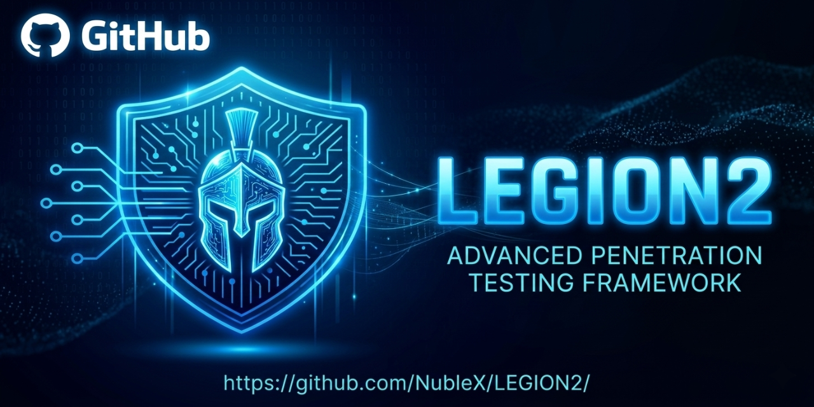
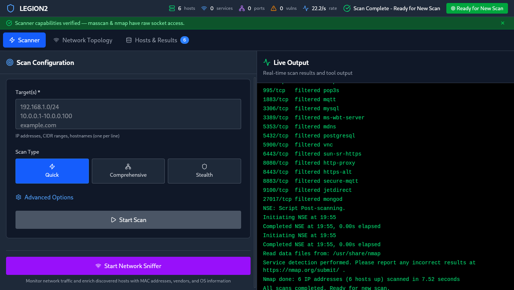
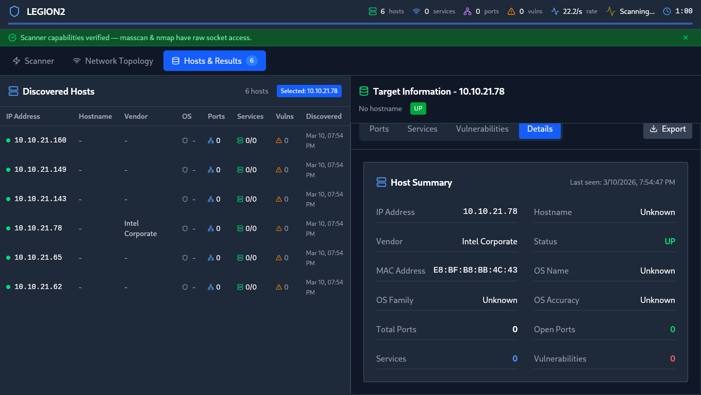
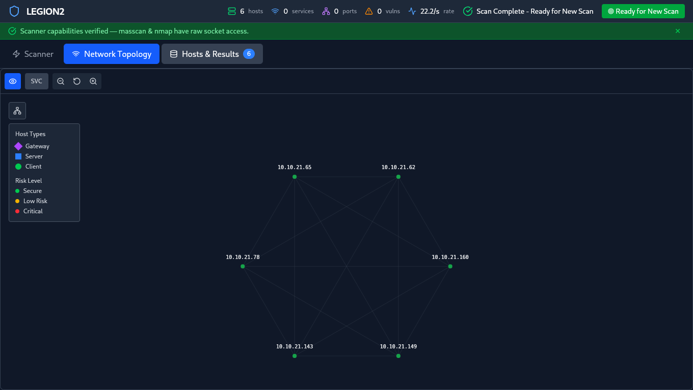

<div align="center">
  

# Advanced Network Security Scanner


## ⚠️ ALPHA VERSION WARNING ⚠️

### Version: 0.3.3-alpha

**A modern, high-performance network penetration testing platform built with Tauri, React, and Rust**

</div>

## What's New in v0.3.3-alpha

This release focuses on scan reliability, correctness, and stability for real-world LAN environments.

**Critical bug fixes:**

- **Target argument passing fixed** — nmap and masscan previously received space-separated IPs as a single shell argument, causing nmap to attempt DNS resolution and fail. Targets are now passed as separate arguments, resolving DNS hangs and incorrect host handling.
- **Infinite recursive scan loop eliminated** — The discovery manager was autonomously re-scanning every newly discovered host, producing cascading `obs:host` events that triggered further scans. All autonomous scanning is now disabled; all scanning is strictly user-initiated.
- **CVE database SQL error fixed** — The `references` column name (a reserved SQLite keyword) caused CREATE TABLE and INSERT failures. Renamed to `cve_references` throughout.
- **Masscan empty XML handled gracefully** — When masscan finds no open ports it writes a near-empty XML file. Previously this logged a parse error. Now LEGION2 checks file size before parsing: files under 100 bytes produce a quiet "no open ports found" message with no error.

**Massmap architecture improvements:**

- **3-phase scanning pipeline** — Phase 1 (nmap -sn ARP discovery) → Phase 2 (masscan targeted ports) → Phase 3 (nmap service detection with `-sT`, no raw socket required). Quick scan now works correctly without root or `cap_net_raw`.
- **Quick scan uses `-sT`** (TCP connect) instead of SYN scan — produces real open/closed/filtered results per host without requiring raw socket privileges.
- **Quick scan NSE scripts** — `banner`, `http-title`, `ssh-hostkey` for fast device type identification.
- **Masscan port list refined** — Quick scan uses a targeted 28-port list covering the most common services; comprehensive scan uses full 1-65535 range.
- **Phase handoff corrected** — Phase 3 nmap correctly narrows targets to hosts discovered by Phase 1, not masscan port counts.

**Dead code removed:**

- `scanner_engine.rs` deleted (unused protocol enum file).

---

## Project Status

LEGION2 v0.3.3-alpha delivers a stable, working scan pipeline on Debian-based Linux systems without requiring root for the common use case. The Tauri/React/Rust architecture eliminates the GUI freezing issues that led to the original LEGION being archived.

**Implemented and stable:**

- 3-phase Massmap pipeline: ARP discovery → masscan port sweep → nmap service detection
- Real-time scan output via Tauri event system
- SQLite persistence for hosts, services, and vulnerabilities
- NSE script support with CVE extraction
- Network topology visualization
- NetSniffer passive packet capture (requires `cap_net_raw`)
- SpiderIoTA IoT device discovery (SSDP, mDNS, WSDD, SNMP, CoAP, MQTT)
- Enrichment pipeline: MAC-vendor OUI lookup, TTL-based OS hints, CVE correlation

---

## Architecture Overview

LEGION2 is built on a modern technology stack:

- **Frontend**: React 18 with TypeScript + Zustand for state management
- **Backend**: Rust with Tauri 2 for high-performance, memory-safe operations
- **Database**: SQLite with async operations for reliable data persistence
- **Scanning Engine**: nmap + masscan integration with real-time output streaming
- **Communication**: Event-driven architecture — Tauri events bridge Rust backend to React frontend

**Pipeline:**

```
Source (nmap / masscan / netsniffer / iot_probe)
  ↓ ObsStream
Transform Pipeline (MAC enrichment → OS fingerprint → service parse → CVE lookup)
  ↓ Enriched Observations
Broadcast Channel
  ├── UiSink    → Tauri events → React frontend
  ├── DbSink    → SQLite (hosts, services, vulns)
  └── VulnSink  → Vulnerability analysis engine
```

---

## Screenshots

<div align="center">
  
  <p><em>Scanner Dashboard with Real-time Live Output</em></p>
</div>

<div align="center">
  
  <p><em>Hosts & Results Analysis Interface</em></p>
</div>

<div align="center">
  
  <p><em>Network Topology Visualization</em></p>
</div>

---

## Features

**Core Scanning Capabilities:**

- 3-phase Massmap: ARP discovery + masscan port sweep + nmap service detection
- Quick scan: network topology and device classification in under 90s for a /24
- Comprehensive scan: all 65535 ports + OS fingerprinting + vulnerability scripts
- Stealth scan: fragmented SYN packets, randomized host order, slow timing
- Real-time scan output with terminal-like live display
- Automatic host discovery and service enumeration
- NSE script support: pass scripts and script-args from the UI

**Enhanced User Experience:**

- Dual-pane interface: Scanner Dashboard and Hosts & Results
- Network topology visualization tab
- Real-time progress tracking with scan metrics
- Live output terminal showing raw scanner output
- Responsive design optimized for security workflows

**Technical:**

- Non-blocking async operations — no GUI freezes
- Memory-safe Rust backend
- Event-driven real-time updates
- SQLite persistence across sessions
- Interface auto-detection for local network scanning

---

## Installation

### Supported Platforms

LEGION2 runs on Debian-based Linux distributions:

| Distribution | Minimum Version | Status |
|---|---|---|
| Kali Linux | 2022.1+ | ✅ Primary target |
| Ubuntu | 22.04 LTS+ | ✅ Supported |
| ParrotOS | 5.0+ | ✅ Supported |
| Debian | 12 (Bookworm)+ | ✅ Supported |
| Linux Mint | 21+ | ✅ Supported |

---

### Option 1 — Build from Source (Recommended)

#### 1. System dependencies

**Kali Linux / ParrotOS / Debian 12+ / Ubuntu 22.04+:**

```bash
sudo apt update
sudo apt install -y \
  build-essential pkg-config curl git \
  libssl-dev \
  libwebkit2gtk-4.1-dev \
  libgtk-3-dev \
  libayatana-appindicator3-dev \
  librsvg2-dev \
  libpcap-dev \
  nmap masscan
```

**Ubuntu 20.04 (uses older webkit):**

```bash
sudo apt update
sudo apt install -y \
  build-essential pkg-config curl git \
  libssl-dev \
  libwebkit2gtk-4.0-dev \
  libgtk-3-dev \
  libappindicator3-dev \
  librsvg2-dev \
  libpcap-dev \
  nmap masscan
```

#### 2. Rust toolchain

```bash
curl --proto '=https' --tlsv1.2 -sSf https://sh.rustup.rs | sh
source ~/.cargo/env
# Verify
rustc --version   # should be 1.70+
```

#### 3. Node.js 18+

```bash
curl -fsSL https://deb.nodesource.com/setup_20.x | sudo -E bash -
sudo apt install -y nodejs
node --version   # should be 18+
```

#### 4. Clone and build

```bash
git clone https://github.com/NubleX/LEGION2.git
cd LEGION2

# Install frontend dependencies
npm install

# Development mode (hot reload)
npm run tauri dev

# Production release binary
npm run tauri build
# Binary: src-tauri/target/release/legion2
```

---

### Option 2 — Pre-built Binary (coming soon)

Packaged `.deb` and AppImage releases will be available on the GitHub Releases page once LEGION2 reaches beta stability.

---

### Runtime Permissions

Certain features require raw socket access. Grant capabilities once after each build, or run as root:

```bash
# NetSniffer (passive packet capture) and masscan SYN scan
sudo setcap cap_net_raw,cap_net_admin=eip $(which masscan)
sudo setcap cap_net_raw+ep src-tauri/target/release/legion2

# Alternative: run as root
sudo src-tauri/target/release/legion2
```

> **Note:** Quick scan (`-sT` TCP connect mode) does **not** require `cap_net_raw`. You can run full quick scans without root. Comprehensive scan uses SYN packets and requires the capability above.

---

## Usage

1. **Launch**: Run the binary from `src-tauri/target/release/legion2` or use `npm run tauri dev` for development.
2. **Configure scan**: Enter target IP, CIDR range (e.g. `192.168.1.0/24`), or space-separated IPs. Select scan type.
3. **Scan types**:
   - **Quick** — Network topology + device classification. ARP discovery → masscan top ports → nmap `-sT -sV`. Under 90s for /24. No root required.
   - **Comprehensive** — Full port scan + OS detection + vulnerability scripts. Requires `cap_net_raw`.
   - **Stealth** — Slow fragmented SYN scan with randomized host order. Requires `cap_net_raw`.
4. **Monitor**: Watch real-time output in the Live Output panel.
5. **Results**: Switch to Hosts & Results tab to view discovered hosts, open ports, service versions, and vulnerabilities.
6. **Topology**: Use the Network Topology tab to visualize discovered network structure.

---

## Contributing

LEGION2 welcomes contributions from the security and development community. Priority areas:

- Additional scanning tool integrations (Nikto, SSLyze, Gobuster)
- Enhanced reporting and export (PDF, JSON, CSV)
- UI improvements and accessibility
- Test coverage improvements
- Documentation

Please review contribution guidelines before submitting pull requests. All contributions must maintain the security focus and professional standards expected of penetration testing tools.

---

## Security Notice

LEGION2 is designed exclusively for authorized penetration testing and security assessment activities. Users must ensure compliance with all applicable laws and regulations in their jurisdiction. Unauthorized use of this tool against systems you do not own or have explicit permission to test is illegal and unethical.

---

## License

LEGION2 is licensed under the GNU General Public License v3.0, ensuring it remains free and open-source for the cybersecurity community while requiring derivative works to maintain the same open-source commitment.

---

## Attribution and Credits

**LEGION2 Development Team (2025-..):**

- **Igor Dunaev / NubleX** - Lead Developer, Architecture Design, and Project Maintainer
- **Community Contributors** - Bug reports, feature requests, and code contributions

**Technology Stack Acknowledgments:**

- **Tauri Team** - For the Rust-based application framework
- **React Team** - For the frontend framework
- **Rust Language Team** - For the memory-safe systems programming language
- **nmap Project** - For the foundational network scanning capabilities
- **masscan Project** - For high-speed port scanning
- **TypeScript Team** - For enhanced developer experience

**Original LEGION Development Heritage:**

- **GoVanguard** - Python modernization and significant feature development of original LEGION
- **SECFORCE** - Original Sparta framework and foundational application design
- **Community Contributors** - Numerous developers who contributed to the original LEGION ecosystem

---

## Roadmap

**v0.3.x (current):**

- ✅ 3-phase Massmap pipeline (ARP + masscan + nmap)
- ✅ NSE script support with CVE extraction
- ✅ NetSniffer passive packet capture
- ✅ SpiderIoTA IoT device discovery
- ✅ Enrichment pipeline (MAC-vendor, OS hints, CVE correlation)
- 🔄 Packaged `.deb` and AppImage releases
- 🔄 Enhanced vulnerability reporting

**v0.4.x:**

- Multi-target session management
- Advanced reporting and export (PDF, JSON, CSV)
- Plugin architecture for custom scanning modules
- Improved topology visualization

**v1.0+:**

- Collaborative scanning for team environments
- Cloud-native deployment options
- Integration with popular security frameworks

---

## Support and Community

- **GitHub Repository**: https://github.com/NubleX/LEGION2
- **Issue Tracker**: https://github.com/NubleX/LEGION2/issues
- **Documentation**: `docs/` directory in the repository

---

*LEGION2 - Modern network security scanning for the next generation of cybersecurity professionals.*

