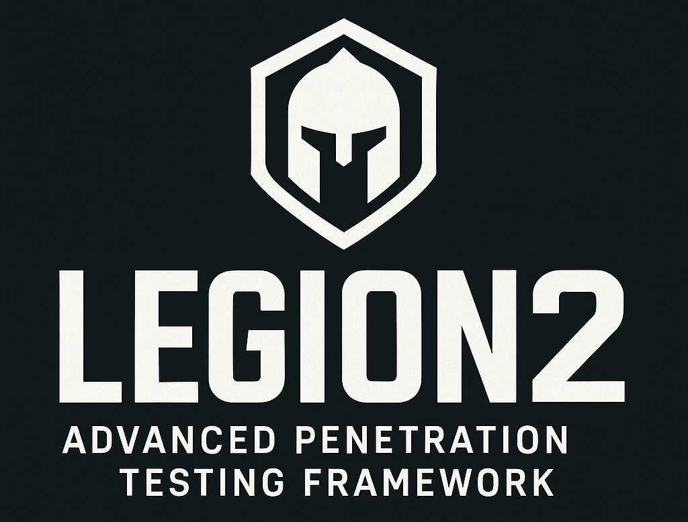
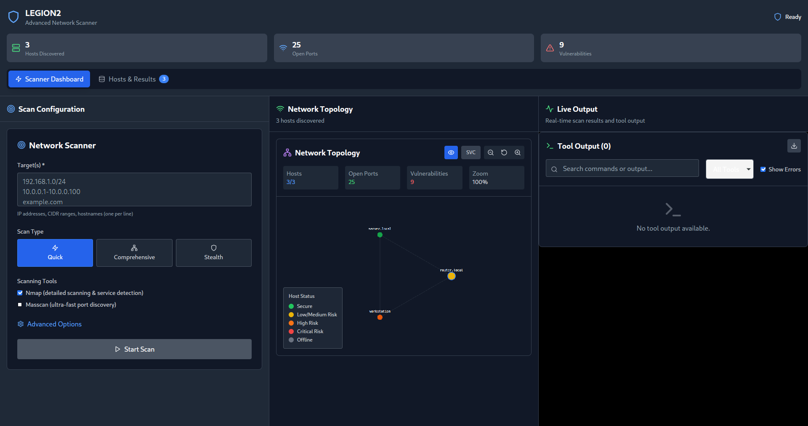
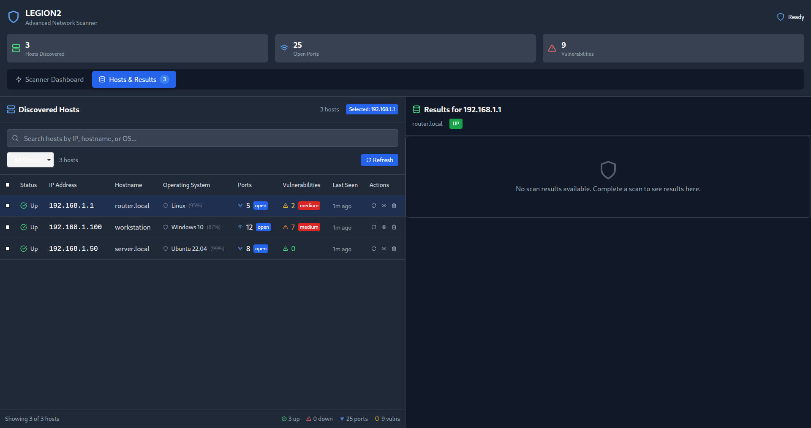

<div align="center">
  

# LEGION2 - Advanced Network Security Scanner


## ⚠️ ALPHA VERSION WARNING ⚠️

### Version: 0.3.0-alpha

**A modern, high-performance network penetration testing platform built with Tauri, React, and Rust**

</div>

## Project Status

LEGION2 v0.3.0-alpha represents a major milestone in the complete architectural modernization of the LEGION penetration testing framework. After addressing the critical GUI freezing and stability issues that led to the original LEGION being archived, we have successfully migrated to a modern Tauri-based architecture with significant improvements in performance, stability, and user experience.

**Recent Achievements:**

- Complete migration from Python/PyQt to Tauri/React/Rust architecture
- Elimination of GUI freezing issues through async-first design
- Real-time scan output and progress tracking
- Modern responsive user interface with live updates
- Stable multi-threaded scanning operations
- Enhanced error handling and recovery mechanisms

## Architecture Overview

LEGION2 is built on a modern technology stack that ensures optimal performance and reliability:

- **Frontend**: React 18 with TypeScript for a responsive, modern user interface
- **Backend**: Rust with Tauri for high-performance, memory-safe operations
- **Database**: SQLite with async operations for reliable data persistence
- **Scanning Engine**: Enhanced nmap integration with real-time output streaming
- **Communication**: Event-driven architecture with WebSocket-style real-time updates

## Features

<div align="center">
  
  <p><em>Scanner Dashboard with Real-time Output</em></p>
</div>

**Core Scanning Capabilities:**

- Advanced nmap integration with multiple scan types (Quick, Comprehensive, Stealth)
- Real-time scan output with terminal-like live display
- Automatic host discovery and service enumeration
- Port scanning with service version detection
- Network topology visualization
- Concurrent scanning operations without GUI blocking

**Enhanced User Experience:**

- Dual-pane interface: Scanner Dashboard and Hosts & Results
- Real-time progress tracking with detailed statistics
- Live output terminal showing scan progress
- Interactive network map with host selection
- Responsive design optimized for security workflows
- One-click scanning of IP addresses and ranges

<div align="center">
  
  <p><em>Hosts & Results Analysis Interface</em></p>
</div>

**Technical Improvements:**

- Non-blocking async operations preventing application freezes
- Memory-safe Rust backend eliminating crashes and memory leaks
- Event-driven real-time updates for immediate feedback
- Structured error handling with automatic recovery
- Comprehensive logging and debugging capabilities

## Installation

### Prerequisites

- **Node.js** 18 or higher
- **Rust** 1.70 or higher with Cargo
- **Modern Linux distribution** (Ubuntu 20.04+, Kali 2022+, ParrotOS)
- **nmap** and other security tools for scanning functionality

### Development Setup

```bash
# Clone the repository
git clone https://github.com/NubleX/legion2.git
cd legion2

# Install frontend dependencies
npm install

# Run in development mode
npm run tauri dev
```

### Building for Production

```bash
# Build the application
npm run tauri build

# The compiled binary will be available in src-tauri/target/release/
```

## Usage

1. **Start the Application**: Launch LEGION2 from the compiled binary or development environment
2. **Configure Scan**: Enter target IP address and select scan type (Quick, Comprehensive, or Stealth)
3. **Monitor Progress**: Watch real-time output in the Live Output panel
4. **View Results**: Switch to Hosts & Results tab to analyze discovered hosts and services
5. **Network Visualization**: Use the interactive network map to explore discovered topology

## Architecture Benefits

The migration to Tauri/React/Rust provides significant advantages over the original Python/PyQt implementation:

**Performance**: Rust backend ensures memory safety and high performance for scanning operations
**Stability**: Async-first design eliminates GUI freezing and improves user experience
**Security**: Memory-safe operations reduce attack surface and improve tool reliability
**Maintainability**: Modern development practices with TypeScript and structured architecture
**Cross-platform**: Tauri enables potential future support for multiple operating systems

## Contributing

LEGION2 welcomes contributions from the cybersecurity and development communities. Areas where contributions are particularly valuable:

- Additional scanning tool integrations (Masscan, Nikto, etc.)
- Enhanced reporting and export capabilities
- Performance optimizations and memory improvements
- User interface enhancements and accessibility
- Documentation and testing improvements

Please review our contribution guidelines before submitting pull requests. All contributions must maintain the security focus and professional standards expected of penetration testing tools.

## Security Notice

LEGION2 is designed exclusively for authorized penetration testing and security assessment activities. Users must ensure compliance with all applicable laws and regulations in their jurisdiction. Unauthorized use of this tool against systems you do not own or have explicit permission to test is illegal and unethical.

## License

LEGION2 is licensed under the GNU General Public License v3.0, ensuring it remains free and open-source for the cybersecurity community while requiring derivative works to maintain the same open-source commitment.

## Attribution and Credits

**LEGION2 Development Team (2025-..):**

- **Igor Dunaev / NubleX** - Lead Developer, Architecture Design, and Project Maintainer
- **Community Contributors** - Bug reports, feature requests, and code contributions

**Technology Stack Acknowledgments:**

- **Tauri Team** - For the excellent Rust-based application framework enabling modern desktop applications
- **React Team** - For the powerful frontend framework driving the user interface
- **Rust Language Team** - For the memory-safe systems programming language powering the backend
- **nmap Project** - For the foundational network scanning capabilities
- **TypeScript Team** - For enhanced developer experience and code reliability

**Original LEGION Development Heritage:**

- **GoVanguard** - Python modernization and significant feature development of original LEGION
- **SECFORCE** - Original Sparta framework and foundational application design
- **Community Contributors** - Numerous developers who contributed to the original LEGION ecosystem

**Open Source Foundation:**
LEGION2 builds upon decades of open-source security tool development. We acknowledge the contributions of the entire cybersecurity open-source community, including the developers of nmap, Python ecosystem, Qt framework, and countless other projects that made the original LEGION possible.

## Roadmap

**Current Focus (v0.2.x):**

- Integration of additional scanning tools (Masscan, Nikto, SSLyzer)
- Enhanced reporting and export capabilities
- Performance optimizations and memory improvements
- Comprehensive testing and stability improvements

**Future Development (v0.3.x):**

- Multi-target scanning with range support
- Advanced vulnerability correlation and reporting
- Plugin architecture for custom scanning modules
- Collaborative scanning for team environments

**Long-term Vision (v1.0+):**

- Machine learning integration for intelligent vulnerability assessment
- Advanced automation and workflow capabilities
- Cloud-native deployment options
- Integration with popular security frameworks

## Support and Community

For bug reports, feature requests, and development discussions, please use our GitHub Issues system. As an active open-source project, we encourage community participation and welcome feedback from security professionals and developers.

**Development Resources:**

- GitHub Repository: https://github.com/NubleX/LEGION2
- Issue Tracker: https://github.com/NubleX/LEGION2/issues
- Documentation: Available in the project repository

---


*LEGION2 - Modern network security scanning for the next generation of cybersecurity professionals.*

Visit https://www.idarti.com
