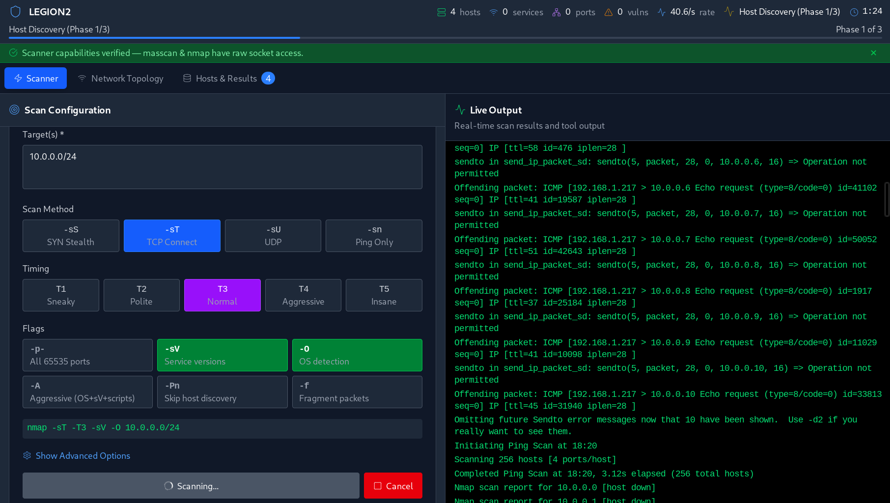
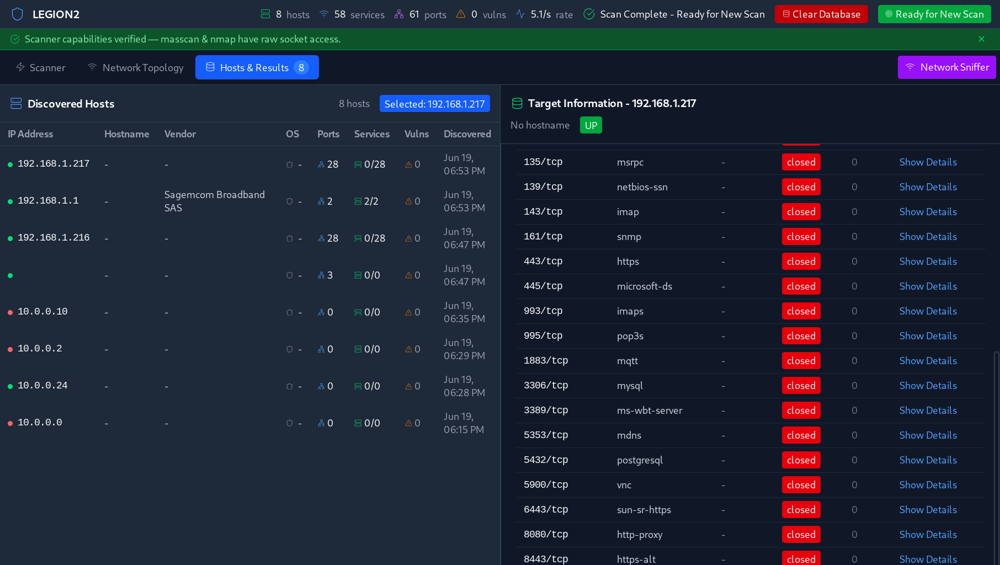
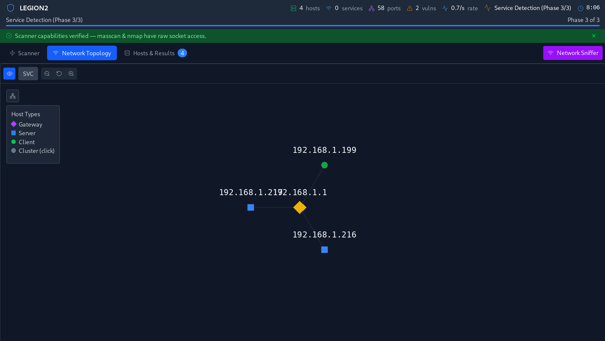

<div align="center">
  

# Advanced Network Security Scanner


### Version: 0.4.0

**A modern, high-performance network penetration testing platform built with Tauri, React, and Rust**

</div>

## What's New in v0.4.0

This release focuses on scan reliability, correctness, and keeping every scanner in sync with a single live database.

**Critical bug fixes:**

- **Target argument passing fixed** — nmap and masscan previously received space-separated IPs as a single shell argument, causing nmap to attempt DNS resolution and fail. Targets are now passed as separate arguments.
- **Closed ports no longer reported as open services** — the stdout parser used `line.contains("open")`, which matched `cl**open**ed`. Closed probe results are now ignored; only `state == open` ports are stored or shown as discovered services.
- **Nmap XML parsing restored** — nmap XML includes a DTD; the parser now accepts it so Phase 3 results populate the ports table instead of silently failing.
- **Infinite recursive scan loop eliminated** — autonomous re-scanning on every new host is disabled; all scanning is user-initiated.
- **CVE database SQL error fixed** — reserved column `references` renamed to `cve_references`.
- **Masscan empty XML handled gracefully** — near-empty XML files produce a quiet "no open ports found" message instead of a parse error.
- **UI stability** — fixed React infinite loop in host list rendering and corrected per-phase scan completion tracking.

**Massmap architecture improvements:**

- **3-phase scanning pipeline** — Phase 1 (nmap `-sn` ARP discovery) → Phase 2 (masscan targeted ports) → Phase 3 (nmap service detection with `-sT`). Quick scan works without root or `cap_net_raw`.
- **Quick scan uses `-sT`** (TCP connect) for real open/closed/filtered results without raw sockets.
- **Quick scan NSE scripts** — `banner`, `http-title`, `ssh-hostkey` for fast device classification.
- **Masscan port list refined** — Quick scan uses a targeted 28-port IoT/service list; comprehensive scan uses full 1–65535.
- **Phase handoff corrected** — Phase 3 narrows targets to hosts discovered in Phase 1, not masscan port counts alone.

---

## Unified Scanner Pipeline

LEGION2 does not treat masscan, nmap, NetSniffer, and IoT Spider as separate silos. Every tool is a **Source** that emits the same `Observation` stream. Those observations flow through a shared transform pipeline (MAC enrichment, OS hints, service parsing, CVE correlation) and are broadcast in parallel to three sinks:

- **UiSink** — Tauri events → React live output, host counters, progress bar
- **DbSink** — batched SQLite writes → persistent hosts, ports, services, vulnerabilities
- **VulnSink** — vulnerability analysis on newly discovered open services

The Scanner tab is where you launch scans and watch raw tool output in real time. Phase indicators (Host Discovery → Port Scanning → Service Detection) reflect the Massmap orchestration layer, which passes discovered hosts from one phase to the next via the database rather than re-parsing stale stdout.

<div align="center">
  
  <p><em>Scanner Dashboard — live nmap/masscan output with phase progress and capability verification</em></p>
</div>

### How the scanners stay in sync

| Component | Role | What it contributes |
| --- | --- | --- |
| **nmap** | Active depth | ARP host discovery, service/version detection, OS fingerprinting, NSE scripts |
| **masscan** | Active speed | High-rate port sweep on alive hosts only; open-port pairs fed into Phase 3 |
| **NetSniffer** | Passive capture | MAC addresses, vendor OUI, TTL-based OS hints, live traffic metrics from libpcap |
| **IoT Spider** | Active probes | SSDP, mDNS, WSDD, SNMP, CoAP, MQTT discovery — lightweight IoT pivot identification |

Massmap coordinates **nmap ↔ masscan**: Phase 1 writes alive hosts to the DB; Phase 2 reads those targets and records open ports; Phase 3 runs nmap `-sV` only on hosts (and ports) already known. NetSniffer and IoT Spider run on the same observation bus, so a MAC learned passively can appear on a host record before or during an active scan, and IoT probe hits merge into the same host rows the UI already shows.

### Database as single source of truth

All sinks read and write through one encrypted SQLite database (`network.db` under `.legion2_data/`). DbSink batches host and service observations every few seconds, upserts by IP and port, and skips down hosts and non-open ports. The frontend does not maintain a parallel scan cache — the **Hosts & Results** tab, port counts in the host table, vulnerability scan targets, and export actions all query the same DB the scanners populate.

<div align="center">
  
  <p><em>Hosts &amp; Results — per-host port state (open/closed), services, and vuln counts from the shared database</em></p>
</div>

When a scan completes, host rows, open-port counts, and service names in the UI match what was persisted — including enrichment from NetSniffer (MAC/vendor) and nmap XML (versions, banners). Closed ports from IoT-style probe lists are stored with `state: closed` when relevant, but are not advertised as discovered services in live output.

The **Network Topology** tab renders the same host set: gateway detection, client/server typing, and edges are derived from DB host metadata and discovery order, not a separate graph store.

<div align="center">
  
  <p><em>Network Topology — live graph synchronized with discovered hosts and roles</em></p>
</div>

**Pipeline diagram:**

```md
Source (nmap / masscan / netsniffer / iot_probe)
  ↓ ObsStream
Transform Pipeline (MAC enrichment → OS fingerprint → service parse → CVE lookup)
  ↓ Enriched Observations
Broadcast Channel
  ├── UiSink    → Tauri events → React frontend
  ├── DbSink    → SQLite (hosts, ports, vulns)
  └── VulnSink  → Vulnerability analysis engine
```

---

## Project Status

LEGION2 v0.4.0 delivers a stable, synchronized scan pipeline on Debian-based Linux. The Tauri/React/Rust architecture eliminates the GUI freezing issues that led to the original LEGION being archived.

**Implemented and stable:**

- 3-phase Massmap pipeline: ARP discovery → masscan port sweep → nmap service detection
- Unified observation bus for nmap, masscan, NetSniffer, and IoT Spider
- SQLite persistence with batched DbSink writes and live UiSink events
- Real-time scan output via Tauri event system
- NSE script support with CVE extraction
- Network topology visualization (DB-backed)
- NetSniffer passive packet capture (requires `cap_net_raw`)
- SpiderIoTA IoT device discovery (SSDP, mDNS, WSDD, SNMP, CoAP, MQTT)
- Enrichment pipeline: MAC-vendor OUI lookup, TTL-based OS hints, CVE correlation

---

## Architecture Overview

LEGION2 is built on a modern technology stack:

- **Frontend**: React 19 with TypeScript + Zustand for state management
- **Backend**: Rust with Tauri 2 for high-performance, memory-safe operations
- **Database**: SQLite with async operations for reliable data persistence
- **Scanning Engine**: nmap + masscan integration with real-time output streaming
- **Communication**: Event-driven architecture — Tauri events bridge Rust backend to React frontend

---

## Features

**Core Scanning Capabilities:**

- 3-phase Massmap: ARP discovery + masscan port sweep + nmap service detection
- Quick scan: network topology and device classification in under 90s for a /24
- Comprehensive scan: all 65535 ports + OS fingerprinting + vulnerability scripts
- Stealth scan: fragmented SYN packets, randomized host order, slow timing
- Real-time scan output with terminal-like live display
- Automatic host discovery and service enumeration
- NSE script support: pass scripts and script-args from the UI
- Network Sniffer button — passive capture alongside active scans
- IoT Spider — protocol-aware discovery for embedded and IoT devices

**Enhanced User Experience:**

- Dual-pane interface: Scanner Dashboard and Hosts & Results
- Network topology visualization tab
- Real-time progress tracking with scan metrics (hosts, ports, services, vulns, rate)
- Live output terminal showing raw scanner output
- Responsive design optimized for security workflows

**Technical:**

- Non-blocking async operations — no GUI freezes
- Memory-safe Rust backend
- Event-driven real-time updates synchronized with SQLite
- Persistence across sessions
- Interface auto-detection for local network scanning

---

## Installation

### Supported Platforms

LEGION2 runs on Debian-based Linux distributions:

| Distribution | Minimum Version | Status |
| --- | --- | --- |
| Kali Linux | 2022.1+ | ✅ Primary target |
| Ubuntu | 22.04 LTS+ | ✅ Supported |
| ParrotOS | 5.0+ | ✅ Supported |
| Debian | 12 (Bookworm)+ | ✅ Supported |
| Linux Mint | 21+ | ✅ Supported |

---

### Option 1 — Build from Source (Recommended)

#### 1. System dependencies

**Kali Linux / ParrotOS / Debian 12+ / Ubuntu 22.04+:**

```bash
sudo apt update
sudo apt install -y \
  build-essential pkg-config curl git \
  libssl-dev \
  libwebkit2gtk-4.1-dev \
  libgtk-3-dev \
  libayatana-appindicator3-dev \
  librsvg2-dev \
  libpcap-dev \
  nmap masscan
```

**Ubuntu 20.04 (uses older webkit):**

```bash
sudo apt update
sudo apt install -y \
  build-essential pkg-config curl git \
  libssl-dev \
  libwebkit2gtk-4.0-dev \
  libgtk-3-dev \
  libappindicator3-dev \
  librsvg2-dev \
  libpcap-dev \
  nmap masscan
```

#### 2. Rust toolchain

```bash
curl --proto '=https' --tlsv1.2 -sSf https://sh.rustup.rs | sh
source ~/.cargo/env
# Verify
rustc --version   # should be 1.70+
```

#### 3. Node.js 18+

```bash
curl -fsSL https://deb.nodesource.com/setup_20.x | sudo -E bash -
sudo apt install -y nodejs
node --version   # should be 18+
```

#### 4. Clone and build

```bash
git clone https://github.com/NubleX/LEGION2.git
cd LEGION2

# Install frontend dependencies
npm install

# Development mode (hot reload)
npm run tauri dev

# Production release binary
npm run tauri build
# Binary: src-tauri/target/release/legion2
```

---

### Option 2 — Pre-built Binary (coming soon)

Packaged `.deb` and AppImage releases will be available on the GitHub Releases page once LEGION2 reaches beta stability.

---

### Runtime Permissions

Certain features require raw socket access. Grant capabilities once after each build, or run as root:

```bash
# NetSniffer (passive packet capture) and masscan SYN scan
sudo setcap cap_net_raw,cap_net_admin=eip $(which masscan)
sudo setcap cap_net_raw+ep src-tauri/target/release/legion2

# Alternative: run as root
sudo src-tauri/target/release/legion2
```

> **Note:** Quick scan (`-sT` TCP connect mode) does **not** require `cap_net_raw`. You can run full quick scans without root. Comprehensive scan uses SYN packets and requires the capability above.

---

## Usage

1. **Launch**: Run the binary from `src-tauri/target/release/legion2` or use `npm run tauri dev` for development.
2. **Configure scan**: Enter target IP, CIDR range (e.g. `192.168.1.0/24`), or space-separated IPs. Select scan type.
3. **Scan types**:
   - **Quick** — Network topology + device classification. ARP discovery → masscan top ports → nmap `-sT -sV`. Under 90s for /24. No root required.
   - **Comprehensive** — Full port scan + OS detection + vulnerability scripts. Requires `cap_net_raw`.
   - **Stealth** — Slow fragmented SYN scan with randomized host order. Requires `cap_net_raw`.
4. **Monitor**: Watch real-time output in the Live Output panel; phase progress updates as Massmap advances.
5. **Results**: Switch to Hosts & Results — data comes from the live database, not a stale scan buffer.
6. **Topology**: Network Topology tab reflects the same host set and roles.
7. **NetSniffer / IoT Spider**: Use from the tab bar when hosts exist; observations merge into the same DB and UI.

---

## Contributing

LEGION2 welcomes contributions from the security and development community. Priority areas:

- Additional scanning tool integrations (Nikto, SSLyze, Gobuster)
- Enhanced reporting and export (PDF, JSON, CSV)
- UI improvements and accessibility
- Test coverage improvements
- Documentation

Please review contribution guidelines before submitting pull requests. All contributions must maintain the security focus and professional standards expected of penetration testing tools.

---

## Security Notice

LEGION2 is designed exclusively for authorized penetration testing and security assessment activities. Users must ensure compliance with all applicable laws and regulations in their jurisdiction. Unauthorized use of this tool against systems you do not own or have explicit permission to test is illegal and unethical.

---

## License

LEGION2 is licensed under the GNU General Public License v3.0, ensuring it remains free and open-source for the cybersecurity community while requiring derivative works to maintain the same open-source commitment.

---

## Attribution and Credits

**LEGION2 Development Team (2025-..):**

- **Igor Dunaev / NubleX** - Lead Developer, Architecture Design, and Project Maintainer
- **Community Contributors** - Bug reports, feature requests, and code contributions

**Technology Stack Acknowledgments:**

- **Tauri Team** - For the Rust-based application framework
- **React Team** - For the frontend framework
- **Rust Language Team** - For the memory-safe systems programming language
- **nmap Project** - For the foundational network scanning capabilities
- **masscan Project** - For high-speed port scanning
- **TypeScript Team** - For enhanced developer experience

**Original LEGION Development Heritage:**

- **GoVanguard** - Python modernization and significant feature development of original LEGION
- **SECFORCE** - Original Sparta framework and foundational application design
- **Community Contributors** - Numerous developers who contributed to the original LEGION ecosystem

---

## Roadmap

**v0.3.x (completed):**

- ✅ 3-phase Massmap pipeline (ARP + masscan + nmap)
- ✅ NSE script support with CVE extraction
- ✅ NetSniffer passive packet capture
- ✅ SpiderIoTA IoT device discovery
- ✅ Enrichment pipeline (MAC-vendor, OS hints, CVE correlation)

**v0.4.x (current):**

- ✅ Unified observation bus and DB/UI synchronisity
- ✅ Closed-port parsing correctness and XML DTD support
- ✅ Scan phase handoff and UI stability fixes
- 🔄 Packaged `.deb` and AppImage releases
- 🔄 Enhanced vulnerability reporting
- 🔄 Multi-target session management

**v1.0+:**

- Advanced reporting and export (PDF, JSON, CSV)
- Plugin architecture for custom scanning modules
- Collaborative scanning for team environments
- Cloud-native deployment options
- Integration with popular security frameworks

---

## Support and Community

- **GitHub Repository**: https://github.com/NubleX/LEGION2
- **Issue Tracker**: https://github.com/NubleX/LEGION2/issues
- **Documentation**: `docs/` directory in the repository

---

*LEGION2 - Modern network security scanning for the next generation of cybersecurity professionals.*
